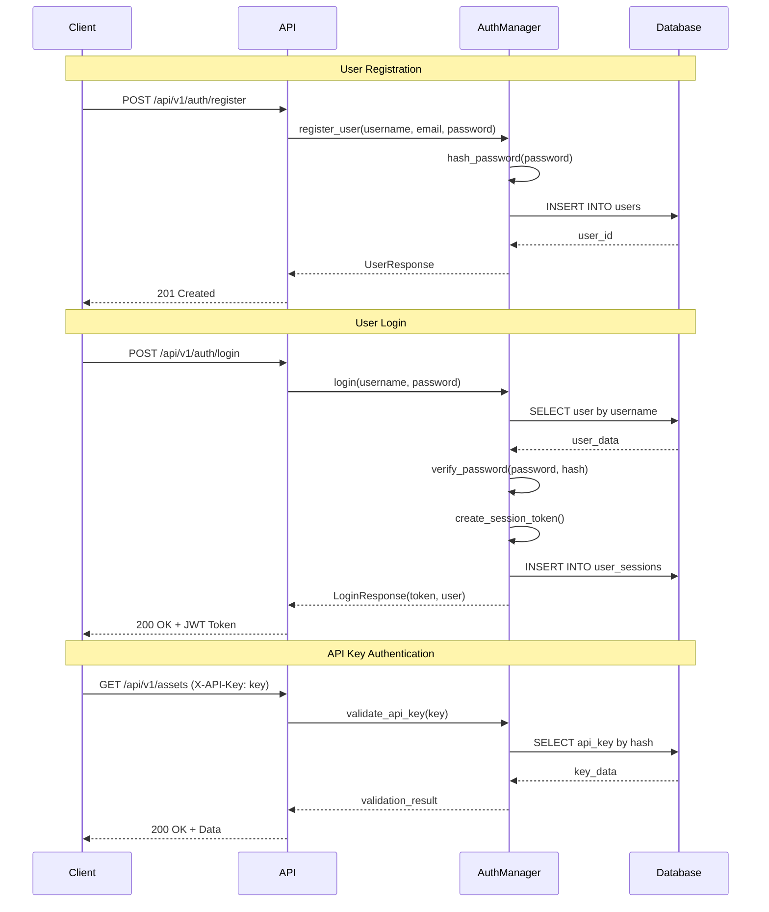
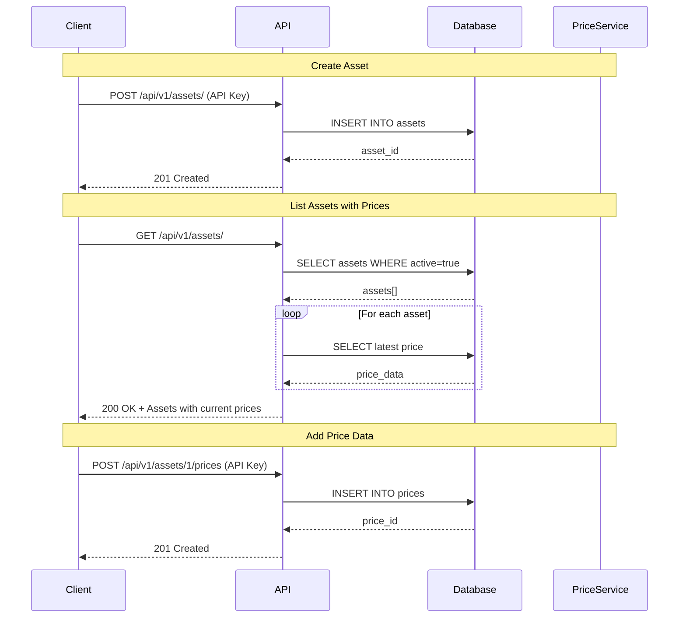
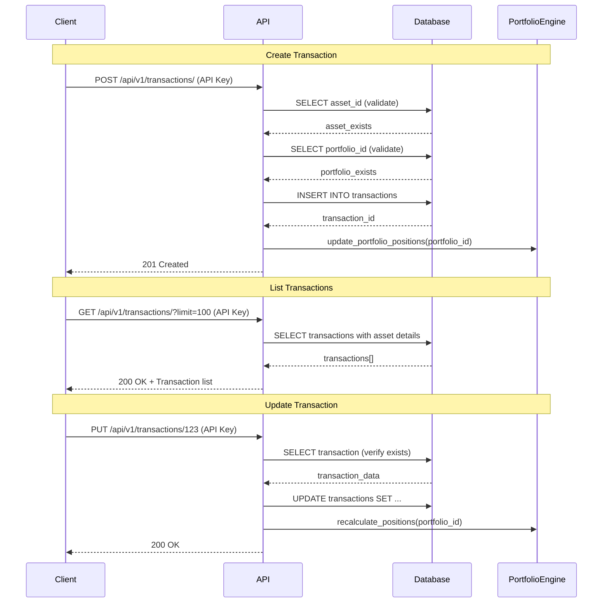
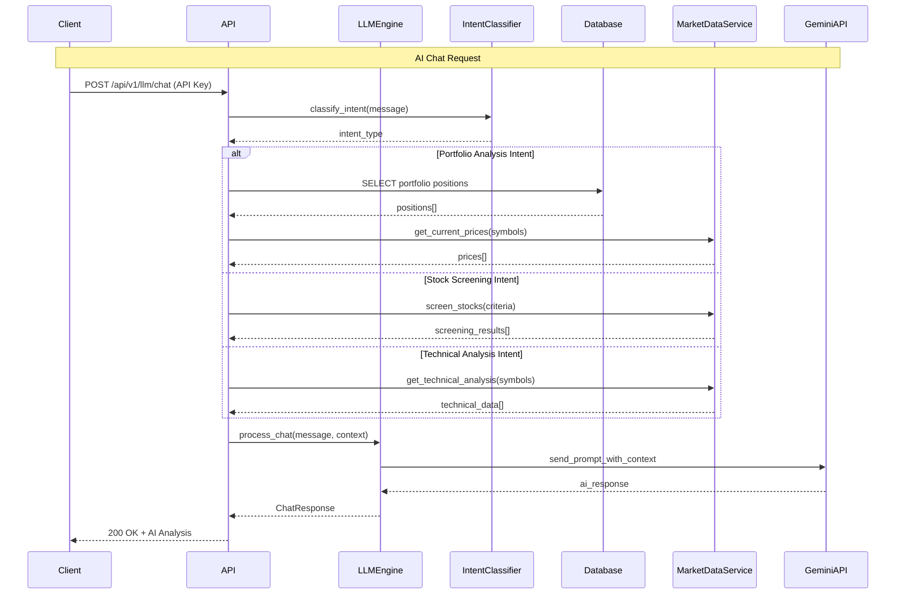
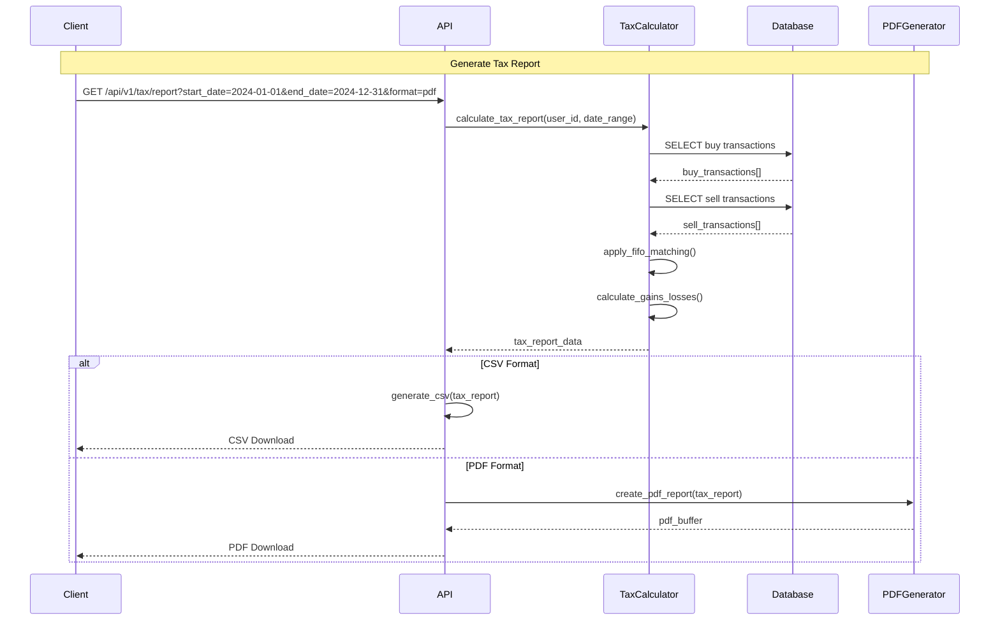
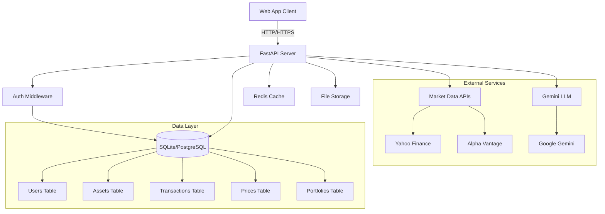
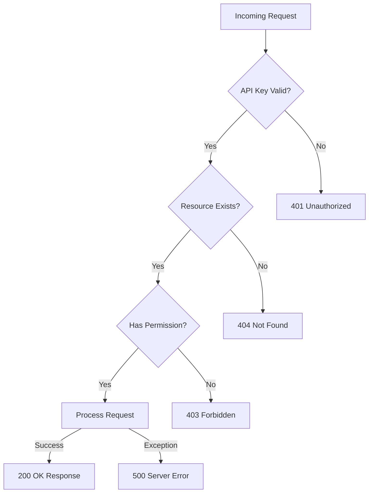
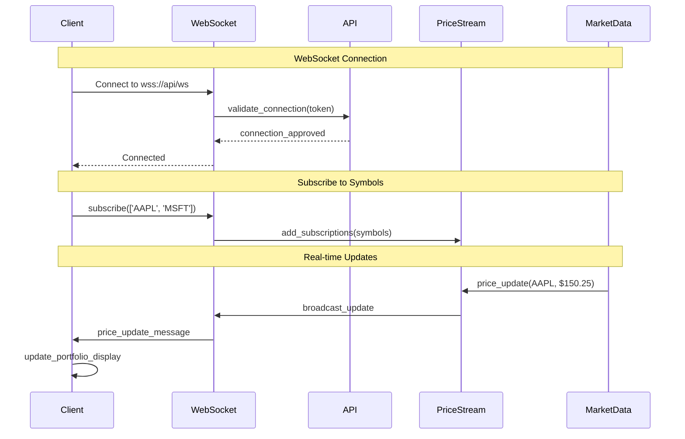

# Portfolio Management API - Flow Diagrams

## 1. User Authentication Flow

## 2. Asset Management Flow

## 3. Transaction Management Flow

## 4. AI/LLM Chat Flow

## 5. Tax Reporting Flow

## 6. Data Flow Architecture

## 7. Error Handling Flow

## 8. Real-time Data Flow (Future Enhancement)

## Key Integration Points for Web Application

### 1. Authentication Strategy
- **JWT Tokens** for session-based auth
- **API Keys** for service-to-service communication
- **Refresh Token** rotation for security
- **Role-based** access control (future)

### 2. Real-time Data Requirements
- **WebSocket** connections for live price updates
- **Server-Sent Events** for portfolio alerts
- **Polling fallback** for unsupported browsers

### 3. Caching Strategy
- **Browser caching** for static assets
- **Application caching** for API responses
- **Redis caching** for frequently accessed data
- **CDN caching** for global performance

### 4. Error Recovery Patterns
- **Retry logic** with exponential backoff
- **Circuit breaker** for external API calls  
- **Graceful degradation** when services are unavailable
- **User-friendly** error messages

### 5. Performance Optimization
- **Lazy loading** for large data sets
- **Virtual scrolling** for transaction lists
- **Debounced search** for asset lookup
- **Optimistic updates** for better UX

### 6. Security Measures
- **HTTPS** everywhere
- **CSRF protection** with tokens
- **XSS protection** with Content Security Policy
- **Input validation** on all endpoints
- **Rate limiting** to prevent abuse

This flow documentation provides the foundation for building a robust, scalable web application that integrates seamlessly with the Portfolio Management API.

