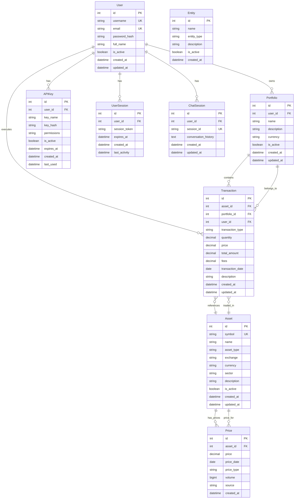

# Portfolio Management API - Data Model & ERD

## Entity Relationship Diagram



## Core Entities

### 1. User
**Purpose:** Central user management and authentication
**Key Relationships:** Owns portfolios, executes transactions, manages API keys

| Column | Type | Constraints | Description |
|--------|------|-------------|-------------|
| id | INTEGER | PRIMARY KEY, AUTO_INCREMENT | Unique user identifier |
| username | VARCHAR(50) | UNIQUE, NOT NULL | User login name |
| email | VARCHAR(100) | UNIQUE, NOT NULL | User email address |
| password_hash | VARCHAR(255) | NOT NULL | Hashed password |
| full_name | VARCHAR(100) | | User's full display name |
| is_active | BOOLEAN | DEFAULT TRUE | Account status |
| created_at | TIMESTAMP | DEFAULT CURRENT_TIMESTAMP | Account creation time |
| updated_at | TIMESTAMP | DEFAULT CURRENT_TIMESTAMP ON UPDATE | Last modification time |

### 2. Portfolio
**Purpose:** Grouping of assets and transactions for organizational purposes
**Key Relationships:** Belongs to user, contains transactions

| Column | Type | Constraints | Description |
|--------|------|-------------|-------------|
| id | INTEGER | PRIMARY KEY, AUTO_INCREMENT | Unique portfolio identifier |
| user_id | INTEGER | FOREIGN KEY (users.id) | Owner of the portfolio |
| name | VARCHAR(100) | NOT NULL | Portfolio display name |
| description | TEXT | | Portfolio description |
| currency | VARCHAR(3) | DEFAULT 'USD' | Base currency |
| is_active | BOOLEAN | DEFAULT TRUE | Portfolio status |
| created_at | TIMESTAMP | DEFAULT CURRENT_TIMESTAMP | Creation time |
| updated_at | TIMESTAMP | DEFAULT CURRENT_TIMESTAMP ON UPDATE | Last modification time |

### 3. Asset
**Purpose:** Master list of tradeable assets (stocks, bonds, ETFs, etc.)
**Key Relationships:** Has prices, referenced in transactions

| Column | Type | Constraints | Description |
|--------|------|-------------|-------------|
| id | INTEGER | PRIMARY KEY, AUTO_INCREMENT | Unique asset identifier |
| symbol | VARCHAR(20) | UNIQUE, NOT NULL | Trading symbol (e.g., AAPL) |
| name | VARCHAR(200) | NOT NULL | Full asset name |
| asset_type | ENUM | ('stock', 'bond', 'crypto', 'etf', 'mutual_fund', 'commodity', 'cash') | Asset classification |
| exchange | VARCHAR(50) | | Trading exchange |
| currency | VARCHAR(3) | DEFAULT 'USD' | Asset currency |
| sector | VARCHAR(100) | | Industry sector |
| description | TEXT | | Asset description |
| is_active | BOOLEAN | DEFAULT TRUE | Asset status |
| created_at | TIMESTAMP | DEFAULT CURRENT_TIMESTAMP | Creation time |
| updated_at | TIMESTAMP | DEFAULT CURRENT_TIMESTAMP ON UPDATE | Last modification time |

### 4. Transaction
**Purpose:** Record of all buy/sell/dividend activities
**Key Relationships:** References asset, belongs to portfolio and user

| Column | Type | Constraints | Description |
|--------|------|-------------|-------------|
| id | INTEGER | PRIMARY KEY, AUTO_INCREMENT | Unique transaction identifier |
| asset_id | INTEGER | FOREIGN KEY (assets.id) | Asset involved in transaction |
| portfolio_id | INTEGER | FOREIGN KEY (portfolios.id) | Portfolio containing transaction |
| user_id | INTEGER | FOREIGN KEY (users.id) | User who executed transaction |
| transaction_type | ENUM | ('buy', 'sell', 'dividend', 'split', 'transfer') | Type of transaction |
| quantity | DECIMAL(15,6) | NOT NULL | Number of shares/units |
| price | DECIMAL(15,6) | NOT NULL | Price per share/unit |
| total_amount | DECIMAL(15,2) | NOT NULL | Total transaction value |
| fees | DECIMAL(10,2) | DEFAULT 0 | Transaction fees |
| transaction_date | DATE | NOT NULL | Date of transaction |
| description | TEXT | | Additional notes |
| created_at | TIMESTAMP | DEFAULT CURRENT_TIMESTAMP | Record creation time |
| updated_at | TIMESTAMP | DEFAULT CURRENT_TIMESTAMP ON UPDATE | Last modification time |

### 5. Price
**Purpose:** Historical and current price data for assets
**Key Relationships:** Belongs to asset

| Column | Type | Constraints | Description |
|--------|------|-------------|-------------|
| id | INTEGER | PRIMARY KEY, AUTO_INCREMENT | Unique price record identifier |
| asset_id | INTEGER | FOREIGN KEY (assets.id) | Asset this price belongs to |
| price | DECIMAL(15,6) | NOT NULL | Price value |
| price_date | DATE | NOT NULL | Date of this price |
| price_type | ENUM | ('open', 'high', 'low', 'close', 'adjusted_close') | Type of price |
| volume | BIGINT | | Trading volume |
| source | VARCHAR(50) | | Data source (yahoo, alpha_vantage, etc.) |
| created_at | TIMESTAMP | DEFAULT CURRENT_TIMESTAMP | Record creation time |

**Indexes:**
- UNIQUE(asset_id, price_date, price_type)
- INDEX(price_date)

### 6. APIKey
**Purpose:** API authentication and access control
**Key Relationships:** Belongs to user

| Column | Type | Constraints | Description |
|--------|------|-------------|-------------|
| id | INTEGER | PRIMARY KEY, AUTO_INCREMENT | Unique API key identifier |
| user_id | INTEGER | FOREIGN KEY (users.id) | Key owner |
| key_name | VARCHAR(100) | | Descriptive name for the key |
| key_hash | VARCHAR(255) | UNIQUE, NOT NULL | Hashed API key value |
| permissions | JSON | | Permissions associated with key |
| is_active | BOOLEAN | DEFAULT TRUE | Key status |
| expires_at | TIMESTAMP | | Key expiration time |
| created_at | TIMESTAMP | DEFAULT CURRENT_TIMESTAMP | Key creation time |
| last_used | TIMESTAMP | | Last usage timestamp |

### 7. UserSession
**Purpose:** User authentication session management
**Key Relationships:** Belongs to user

| Column | Type | Constraints | Description |
|--------|------|-------------|-------------|
| id | INTEGER | PRIMARY KEY, AUTO_INCREMENT | Unique session identifier |
| user_id | INTEGER | FOREIGN KEY (users.id) | Session owner |
| session_token | VARCHAR(255) | UNIQUE, NOT NULL | Session token |
| expires_at | TIMESTAMP | NOT NULL | Session expiration |
| created_at | TIMESTAMP | DEFAULT CURRENT_TIMESTAMP | Session start time |
| last_activity | TIMESTAMP | DEFAULT CURRENT_TIMESTAMP | Last activity timestamp |

### 8. Entity
**Purpose:** Brokers, exchanges, and other financial entities
**Key Relationships:** Referenced in transactions (future enhancement)

| Column | Type | Constraints | Description |
|--------|------|-------------|-------------|
| id | INTEGER | PRIMARY KEY, AUTO_INCREMENT | Unique entity identifier |
| name | VARCHAR(200) | NOT NULL | Entity name |
| entity_type | ENUM | ('broker', 'exchange', 'bank', 'other') | Entity classification |
| description | TEXT | | Entity description |
| is_active | BOOLEAN | DEFAULT TRUE | Entity status |
| created_at | TIMESTAMP | DEFAULT CURRENT_TIMESTAMP | Creation time |

### 9. ChatSession
**Purpose:** AI/LLM chat session management
**Key Relationships:** Belongs to user

| Column | Type | Constraints | Description |
|--------|------|-------------|-------------|
| id | INTEGER | PRIMARY KEY, AUTO_INCREMENT | Unique chat session identifier |
| user_id | INTEGER | FOREIGN KEY (users.id) | Session owner |
| session_id | VARCHAR(100) | UNIQUE, NOT NULL | External session identifier |
| conversation_history | JSON | | Chat message history |
| created_at | TIMESTAMP | DEFAULT CURRENT_TIMESTAMP | Session creation time |
| updated_at | TIMESTAMP | DEFAULT CURRENT_TIMESTAMP ON UPDATE | Last message time |

## Database Views (Computed/Virtual Tables)

### 1. portfolio_positions
**Purpose:** Current holdings per portfolio
```sql
CREATE VIEW portfolio_positions AS
SELECT 
    t.portfolio_id,
    t.asset_id,
    a.symbol,
    a.name,
    SUM(CASE WHEN t.transaction_type = 'buy' THEN t.quantity 
             WHEN t.transaction_type = 'sell' THEN -t.quantity 
             ELSE 0 END) as current_quantity,
    AVG(CASE WHEN t.transaction_type = 'buy' THEN t.price END) as avg_cost,
    p.price as current_price,
    (current_quantity * p.price) as current_value
FROM transactions t
JOIN assets a ON t.asset_id = a.id
LEFT JOIN (
    SELECT DISTINCT asset_id, 
           FIRST_VALUE(price) OVER (PARTITION BY asset_id ORDER BY price_date DESC) as price
    FROM prices 
    WHERE price_type = 'close'
) p ON a.id = p.asset_id
WHERE t.transaction_type IN ('buy', 'sell')
GROUP BY t.portfolio_id, t.asset_id, a.symbol, a.name, p.price
HAVING current_quantity > 0;
```

### 2. portfolio_performance
**Purpose:** Portfolio-level performance metrics
```sql
CREATE VIEW portfolio_performance AS
SELECT 
    portfolio_id,
    COUNT(DISTINCT asset_id) as asset_count,
    SUM(current_value) as total_value,
    SUM(current_quantity * avg_cost) as total_cost,
    (SUM(current_value) - SUM(current_quantity * avg_cost)) as unrealized_gain,
    ((SUM(current_value) / SUM(current_quantity * avg_cost)) - 1) * 100 as return_percent
FROM portfolio_positions
GROUP BY portfolio_id;
```

## Key Business Rules

### 1. Transaction Validation
- Buy transactions must have positive quantity and price
- Sell transactions cannot exceed current holdings (future enhancement)
- Transaction dates cannot be in the future
- Total amount should equal quantity × price + fees

### 2. Asset Management
- Asset symbols must be unique within the system
- Only active assets can be traded
- Price records should not have future dates

### 3. Portfolio Rules
- Each user can have multiple portfolios
- Portfolios can contain multiple assets
- Portfolio currency determines reporting currency

### 4. Security & Access Control
- API keys are hashed and never stored in plain text
- Sessions have expiration times
- User passwords are hashed using secure algorithms
- Soft delete approach (is_active flag) for most entities

## Data Integrity Constraints

### Foreign Key Constraints
- `transactions.asset_id` → `assets.id`
- `transactions.portfolio_id` → `portfolios.id`  
- `transactions.user_id` → `users.id`
- `prices.asset_id` → `assets.id`
- `portfolios.user_id` → `users.id`
- `api_keys.user_id` → `users.id`
- `user_sessions.user_id` → `users.id`

### Check Constraints
- `transactions.quantity` > 0
- `transactions.price` > 0
- `prices.price` > 0
- `assets.asset_type` IN allowed types
- `transactions.transaction_type` IN allowed types

### Indexes for Performance
- `idx_transactions_portfolio_date` ON `transactions(portfolio_id, transaction_date)`
- `idx_transactions_asset_date` ON `transactions(asset_id, transaction_date)`
- `idx_prices_asset_date` ON `prices(asset_id, price_date)`
- `idx_assets_symbol` ON `assets(symbol)`
- `idx_sessions_token` ON `user_sessions(session_token)`

This data model supports the full functionality of the Portfolio Management API while maintaining data integrity and optimal performance for common queries.

